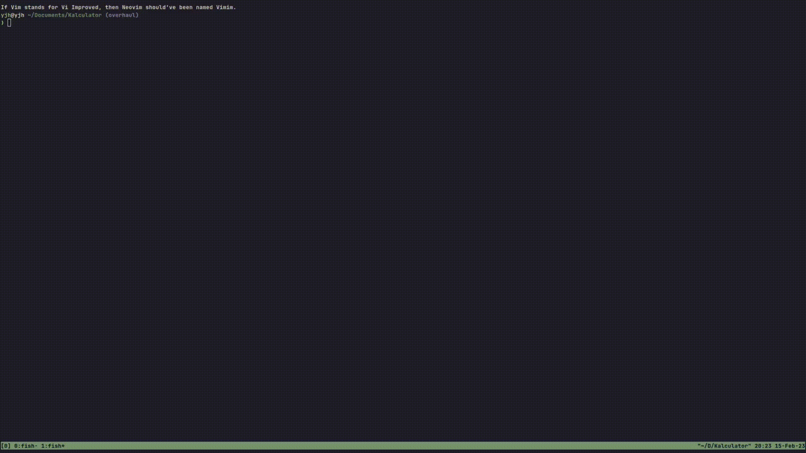

# gdb.nvim


Super simple GDB integration with Neovim. This isn't a general debugger, 
this plugin is specifically for `gdb` and possibly for `rust-gdb` as well.

# Installation
You can use whichever package manager you prefer. In `packer.nvim` you can choose either option listed
1. `use 'AlphabetsAlphabets/gdb.nvim'`
2. `use 'https://github.com/AlphabetsAlphabets/gdb.nvim'`

# Configuration
There are currently two vairables gdb.nvim works with.
1. `default_to_buf`. `boolean`, if `true` then prompt asking for source file will not be asked. Defaults to `true`.
2. `detect_name`. `boolean`. If `true` then asking for binary file will not be asked. Defaults to `true`.

# Usage
The command `:Debug` has been exposed. Since keymaps are personal I decided not to give it a mapping.

## Configuration
```lua
local gdb = require("gdb")

local opts = {
	default_to_buf = true,
	detect_binary = false,
}

gdb.setup(opts)
```

# Motivation
I've been progamming for about two years now and I've never actually used a debugger before, I used it for the first time for school work.
Ever since I've been desperately looking to get a debugging experience working for Neovim once I understood how important it was. There are two plugins for this.
1. DAP
2. Vimpsector

I couldn't setup DAP and the Vimpsector workflow just wasn't for me. One of them was the cursor moving to the start
of the first whenever I stepped forward or into really bugged me. Another thing is that Vimpsector is made mainly for
Vim, not Neovim.

I know what `gdb` was but never understood the value of a debugger. So, I decided to make this to integrate the usage of gdb into Neovim.

# Contributing
This being my first try at actually involving a community and not just me or my friends, contributing guidelines are something new to me.
This is what I have for now, and I will come up with better rules as time passes. If you want to know what features I have planned please
take a look at `FEATURES.md`

1. There isn't a solid or concrete instruction for contributing, but feel free to contribute to it :D.
2. Anything can be discussed. If you feel something is irrelevant or unneeded, feel free to do so.

The general guideline for contributing (at least for now) is to make fork, make your changes, test changes, submit a PR.
The development branch is the `dev` branch. The `master` branch is the usable version.
